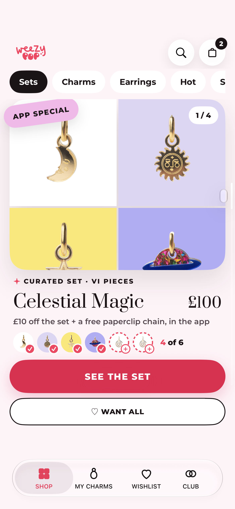
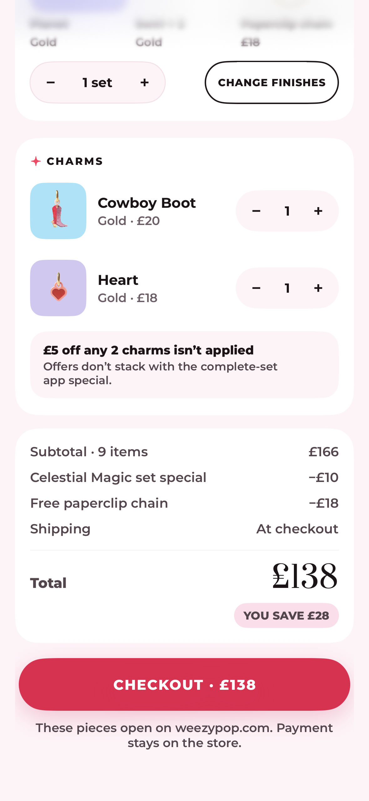
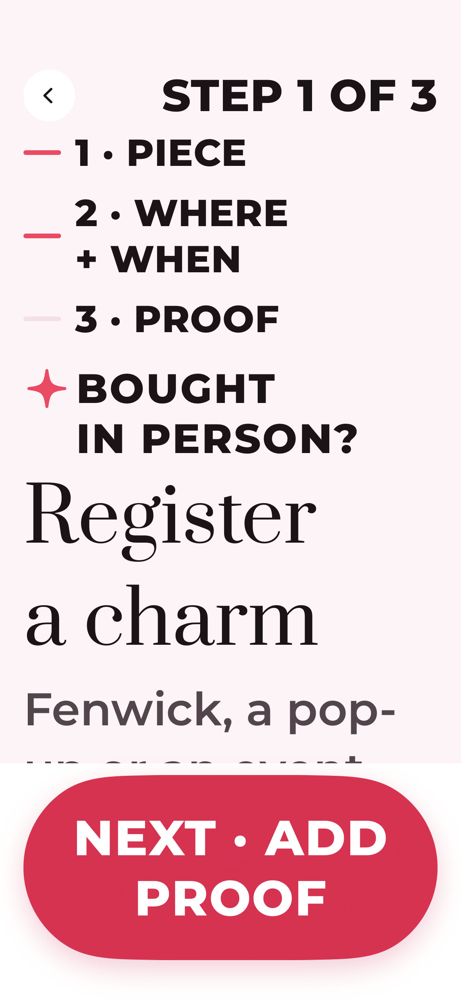

# Build 31 · Pop Studio design review

Version **1.0 (31)**. **176 JPEGs: 101 inventory screens and 75 additional continuations. All 106 supplied IDs are accounted for; five are explicitly not captured.** This is a new review baseline; older RELEASE28/RELEASE29 labels in filenames remain the designer’s screen IDs. They do not mean these are captures from an old app build.

## Import and pair

1. Read [manifest.json](manifest.json). Every supplied inventory ID is listed, including screens not captured and why.
2. Import JPEGs from [import-batches.json](import-batches.json), no more than 50 per call. Filenames are relative to this folder.
3. Pair by exact ID using [screens.csv](inventory/screens.csv) and [SCREENS.md](inventory/SCREENS.md). Review the supplied [CHANGELOG.md](inventory/CHANGELOG.md) first for the updated set design.
4. Additional scroll continuations use the parent screen ID plus `-more`, `-more-2`, etc. The manifest records their parent and scroll offset. Canonical continuations from the supplied inventory keep their exact IDs.
5. [capture-inventory.csv](capture-inventory.csv) includes additional continuation IDs alongside the supplied inventory. The four `import-batch-XX.txt` files provide full repository paths for each batch.
6. Return numbered pins, `FIXES.md` keyed by screen ID, and a short summary.

## Capture context

- **Native:** iPhone 16 Pro simulator, iOS 27.0. Production SwiftUI content rendered in the isolated XCTest harness on a controlled **393×852pt** canvas at **3×**, exported as **1179×2556px JPEG, quality 80**. The hardware’s native width is 402pt; this canvas matches the requested 393pt designs. Older375/440width labels remain in canonical IDs for pairing, but these captures use the requested393pt viewport.
- **Data:** Claire; Celestial Magic **4 of 6**; Board 4’s **£138** verified example basket (**£166 − £10 − £18**). Two loose pieces are Cowboy Boot £20 and Heart £18. Set-only pieces captures follow their supplied set-only reference.
- **Reference-only Heart:** the ordinary Heart in the design is an isolated display example. The current live Heart listing is personalised and remains website-only. Its review title and the Cowboy Boot’s £20 reference price never alter Shopify. These stills do not prove that the live Heart can be added through the app.
- **Largest text:** actual `accessibility5` basket, finish-review and registration captures, with scroll continuations. Layout issues are left visible for review.
- **Web:** current app-only web templates on a synthetic in-memory loopback service, captured at 393×852pt/3× in a dedicated mobile browser. No fabricated Safari bars or customer-website changes.

These are **content review captures**, not screenshots taken from the TestFlight binary or proof of shipping AppRoot, OAuth, payment, push delivery or deferred installation. The £138 quote and paid gift receipt are synthetic layout evidence. Production app source is checked against the frozen released build-31 inventory; see [provenance.json](provenance.json). Detailed per-image provenance is in [capture-details.json](capture-details.json).

## Approved product boundaries

The existing customer shop stays untouched. Shared wishlists, stacks, invitations and gift pages live on the separate app-only service. Gifts require an explicit choice; hidden packing-slip prices are not promised without Shopify support. These were approved deviations from the original web/theme proposal.

Merchant-dependent set and finish-photo states retain their real pending/unavailable presentation. A picture becoming available in an isolated reference fixture is not confirmation that Nat has completed the live photo assignment.

## Not captured

The manifest identifies Shopify-owned code entry and checkout without a fresh live session, parked cash rewards and custom-code picking, and the unimplemented deferred first-install invitation screen W-07. The current installed-app import journey is captured separately as X-04. No older screenshot or design artwork is substituted for a missing current screen.

## Quick preview

| Set post | Verified example basket | Registration · largest text |
| --- | --- | --- |
|  |  |  |

[Validation and coverage](validation.json) · [Baseline changes](changes.json) · [Standing review rules](../../docs/DESIGN-AGENT-REVIEW.md)
