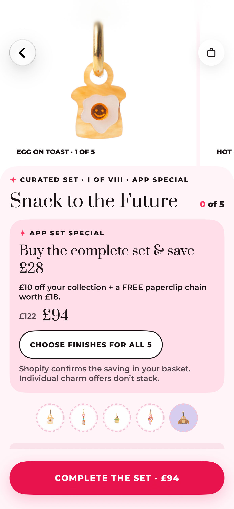
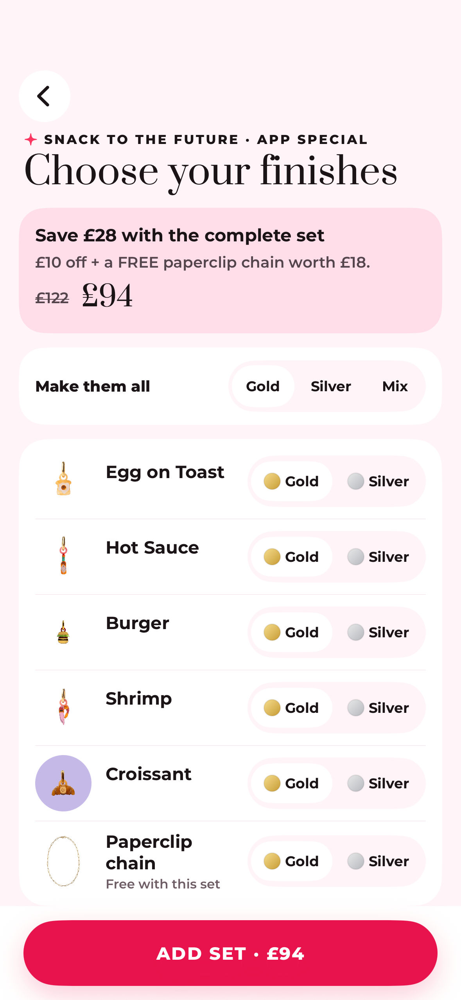
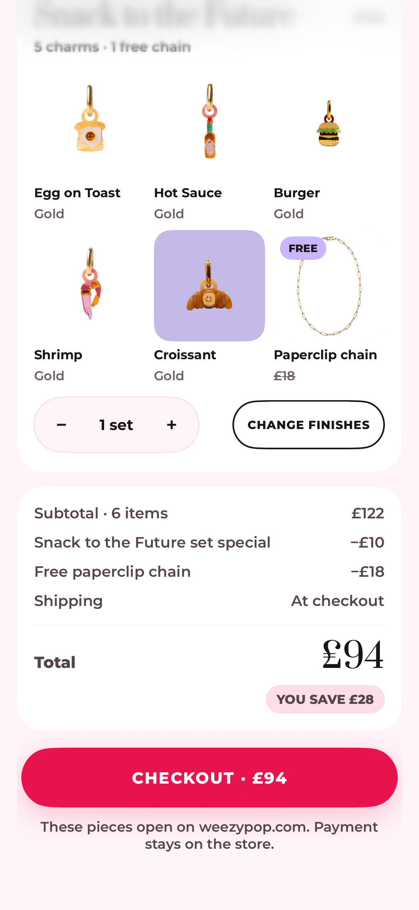

# Review 35 · Complete sets, offers and navigation

**For Pop Studio’s design agent · 8 October 2026.** Build 34 is the signed-off design baseline, as confirmed by Pete. This is a focused extension of that approved design, based on Nat’s latest feedback and the subsequent user-flow checks. Keep its Prata/Montserrat typography, pink palette, photo treatment, stickers, collecting meter and native navigation.

**Release identity:** “35” is this review’s sequence number. These are fresh local candidate captures; the app’s build configuration and the latest valid TestFlight upload are still **34**. No build 35 has been submitted to Apple by this review task. No merchant, customer, storefront, discount or live purchase was changed to produce this pack.

## What was added, and why

The following IDs are assigned to this client brief, continuing the review sequence. They are not findings returned by the design agent. F-62–F-69 remain in the accepted build-34 baseline; do not reopen their approved treatments.

| ID | Added or corrected | Why | Review evidence |
|---|---|---|---|
| F-70 | A complete-set action opens the whole-set finish chooser and adds a grouped set **with its free chain**. Individual ADD actions remain individual purchases. | Nat’s basket showed five separate charms and the ordinary pair offer after “Complete the set”. A matching collection of loose items is not an explicit complete-set purchase. | `S-03-set-page-snack`, `complete-set-finish-review-snack`, `brand-basket-set-snack-pieces`, `brand-basket-set-snack-summary` |
| F-71 | The app-special card sits immediately after the set title, before the small member strip, collecting meter and selection list. | Customers should see the whole-set benefit before deciding which pieces to add. The previous card appeared after the badge, far down the page. | `S-03-set-page`, `S-03-set-page-snack`, both largest-text variants and continuations |
| F-72 | A variant-dependent regular price, total saving and payable set estimate appear in the offer and finish review. Basket regular price includes the chain. | The old £104 Snack button was the sum of charms rather than its £94 complete-set estimate. Omitting the chain understated the regular value and hid part of the benefit. | Snack set/finish/basket sequence; canonical Claire £138 basket summaries |
| F-73 | Full-screen set Back buttons close their owning presentation. Pushed product pages retain native Back/swipe and set reading position. | Nat’s arrow did not return to the preceding page. A modal’s owner must actually clear the selected set. | Set-page captures for appearance; named real interaction tests in `TESTS.json` for behaviour |
| F-74 | Adding from the finish chooser dismisses that chooser before opening the basket. | Competing sheet presentations could hide the basket or leave the wrong screen visible after an add. | Finish → basket sequence; real complete-set interaction checks |
| F-75 | A documented silver-hoop image workflow: photograph each actual design/colour in the correct metal and assign the exact variant in app admin. | Nat asked whether every lifestyle image needs recreating. One accurate selected-variant image is sufficient for each actual colour/metal combination; the whole gallery does not need duplication. | Merchant guidance below; this pack does not invent new silver photos |
| F-76 | Quote recovery uses a real scroll region above its growing footer, with a 44pt Continue browsing target. | Simulation exposed a small recovery target and largest-text content overlapping the action area. | `M-12-basket-quote-failed`, `M-12-basket-quote-failed-largest` and continuations |
| F-77 | An explicit decision between the existing £18 multifunctional chain and the distinct £16 necklace chain. | Nat’s £26 saving assumes the £16 product. The current campaign specifies the £18 product and therefore saves £28. Silently changing product identity would change the offer. | Current £18 campaign throughout this review; decision table below |

## Visual review sequence

<table><tr><th>Offer before selection</th><th>All finishes + free chain</th><th>Grouped basket and saving</th></tr><tr><td></td><td></td><td></td></tr></table>

These previews use the current £18 chain. Open each exact-ID JPEG for full resolution and use its `-more` files for the remainder of the page. Largest-text variants are separate captures, not zoomed normal-text images.

## The revised set page

Order: hero photography → set title/curated eyebrow → **app-special card** → member strip → ownership/basket meter and help → individual member rows → badge. At normal text, the primary action remains fixed at the bottom. At accessibility sizes it follows the scrollable content so it can grow and remain reachable. Long pages scroll through overlapping phone-sized continuations; do not shrink or squeeze the entire page into a single viewport.

The card uses the approved pale pink `#FFDCE9`, 24pt corners, 16pt inner padding and an 8pt vertical stack. The page retains its 16pt horizontal inset. Its content is:

1. Eyebrow: **APP SET SPECIAL**.
2. Prata 22pt headline: **Buy the complete set & save £[saving]**.
3. Montserrat 13pt semibold: **£10 off your collection + a FREE paperclip chain worth £[chain].**
4. Regular total, including the chain, struck through; payable estimate in Prata 24pt.
5. White outlined capsule: **CHOOSE FINISHES FOR ALL [piece count]**; at least 48pt high, 1.5pt ink outline.
6. Supporting copy: **Shopify confirms the saving in your basket. Individual charm offers don’t stack.**

Do not hardcode £26 into every card. All amounts follow the exact selected Shopify variants and campaign chain. A price preview is not a confirmed checkout quote. Unavailable, invalid or excluded combinations must not display an addable complete-set promise.

### Primary action states

| State | Copy and action |
|---|---|
| Eligible complete set, nothing owned or pending | **Complete the set · £[payable estimate]** → choose every charm finish and free-chain finish |
| Some pieces owned or pending | **Add [N] missing pieces · £[sum]**, or **Add the last [N] · £[sum]** → add the missing pieces as individual lines. The separate offer card still explicitly offers buying the whole set. |
| Only some missing pieces available | **Add [N] available pieces · £[sum]** → add those pieces; do not imply unavailable pieces or a verified complete-set saving |
| Every missing piece in the basket | **Review basket · £[pending price]**; help remains **All lined up. Complete once Shopify confirms your order.** |
| Verified complete ownership | **Share your completed set** |

Individual row **ADD · £[variant price]** does not silently opt into the full-set offer. Pending pieces never become owned, earn a badge or increase sets done. The existing £5 off every two eligible individual charms remains separate. Terry de Havilland remains excluded from these complete-set and individual-charm offers. Existing gift choices remain explicit.

## Finish chooser and basket

The whole-set chooser includes all required quantities, even duplicate charms, plus the chain’s exact variant. The new summary appears above finish choices: **Save £[saving] with the complete set**, **£10 off + a FREE paperclip chain worth £[chain]**, struck-through regular price and payable estimate. Its footer is **ADD SET · £[payable]**; otherwise **CHOOSE AVAILABLE FINISHES**, disabled until the selection is valid.

One full-set group must survive into the basket, including the free chain. The group’s regular total includes that chain; the payable set amount is the charm total less £10. Ordinary pair savings must not stack on grouped complete-set pieces. Shopify’s verified quote remains authoritative before checkout is enabled. The mocked confirmed captures show this presentation, not evidence of a live paid order.

The canonical Claire basket remains: £166 subtotal − £10 complete-set saving − £18 free chain = **£138**, including the £20 Cowboy Boot and £18 ordinary Heart reference pieces. Its ordinary Heart is synthetic reference data: the live personalised Heart remains website-only. The pending quote variants must not present the £138 example as already verified. Recovery variants disable checkout and retain the basket while offering retry/browsing.

## Chain decision — needed before final offer copy

| Campaign choice | Snack charms | Chain regular value | Regular total including chain | Combined benefit | Complete-set payable |
|---|---:|---:|---:|---:|---:|
| **Currently configured:** multifunctional paperclip chain | £104 | £18 | £122 | £28 | £94 |
| **Nat’s requested alternative:** charm necklace chain | £104 | £16 | £120 | £26 | £94 |

These are different Shopify products: [£18 multifunctional paperclip chain](https://weezypop.com/products/multifunctional-paperclip-chain) and [£16 charm necklace chain](https://weezypop.com/products/charm-necklace-chain). This pack keeps the existing £18 configuration pending confirmation. Switching to £16 requires an explicit campaign/product-eligibility update and a repeat of quote/non-stacking checks; it is not merely a copy edit. Do not mark this merchant decision as a failed layout or invent the alternative in the current screenshots.

## Silver hoop photos — Nat and Lou’s part

In the app-only admin, open **Products → the earring listing → Variant photos**. Select the real colour/design and metal variant, then match its thumbnail to an accurate product photograph. Save and verify Gold → Silver → Gold in the app. The selected image must show the chosen hoop metal and design colour. Do this per actual colour/metal combination: a generic silver-hoop picture does not accurately represent every differently coloured earring.

One suitable silver photograph per combination is enough for the selected image; other lifestyle/gallery photographs can remain shared. Existing Gold photos can be reused only where they actually depict Gold. App-only photo mappings can use images already in Shopify without changing the customer website. New uploaded Shopify media and its storefront visibility need deliberate merchant handling; this review authorises no new storefront edits. No replacement photographs or speculative mappings were created for this review.

## Typography, colour and accessibility

Keep Prata for editorial headings/prices and Montserrat for controls, names and supporting text. Retain action pink `#E8144C` with **white** labels, blush `#FFF3F8`, pale pink `#FFDCE9` and ink `#1C1418` for neutral-surface text. Preserve the build-34 Liquid Glass navigation, tile grounds, readable missing photography, capped small stickers and basket counters. This is not a global colour or type redesign.

The new offer and finish summary must wrap naturally at actual iOS accessibility5. Price and action must remain present and reachable. Do not reduce user text size to make the card look shorter. Review genuine continuation captures to check the last row, badge and footer. Recovery scrolling must end above the real footer; Continue browsing has a 44pt target.

## Capture and evidence boundaries

- iPhone 16 Pro simulator running iOS 27. Its native screen is 402pt wide; these production SwiftUI content renders use a declared **393×852pt controlled canvas at 3×**. JPEG 80, 1179×2556px, embedded sRGB converted from the native ICC profile. No composited bars, image retouching or long-page scaling.
- Claire’s Sets example uses Moon + Sun owned, **2 of 6** Celestial; her canonical basket reference remains **4 of 6 / £138**. Snack is **0 of 5**. The six-piece design fixture does not change the live Shopify five-piece Celestial membership.
- Sample stock and selected photographs are assigned only inside the isolated reference fixture. These are current production-view layouts with synthetic state, not shipping AppRoot, live sign-in, payment or physical-device acceptance screenshots.
- Real navigation/add/Undo/duplicate tests are recorded separately. Pending quantities are checked independently from paid ownership. Static before/after captures alone do not prove taps.
- Shared-web pages are visually unchanged from the signed-off baseline and are not recaptured. F-50 remains accepted **partial**: reliable Safari reopening still needs the separate associated link origin and a real-device check. No fabricated Safari capture is supplied.
- Prior simulation retained four unsuppressed accessibility-audit findings. Focused passing tests and this design pack do not erase them or claim all launch/device gates passed.

## What to send back

Review only the fresh files in `import-batches.json`, alongside their build-34 predecessors. Start with the Snack set → finish chooser → basket sequence, then Celestial’s pending/lined-up states, canonical £138 summaries and largest-text recovery. Pin any changes to the exact screen IDs and return a review canvas, `FIXES.md` and `fixes.json`. Distinguish visual findings, behaviour issues and the F-77 merchant product decision. Preserve signed-off build-34 components unless these additions reveal a specific regression.
