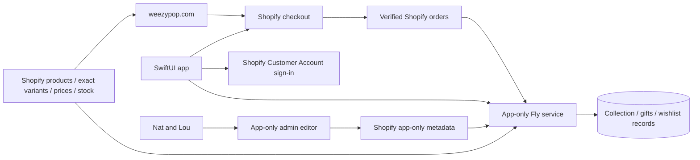
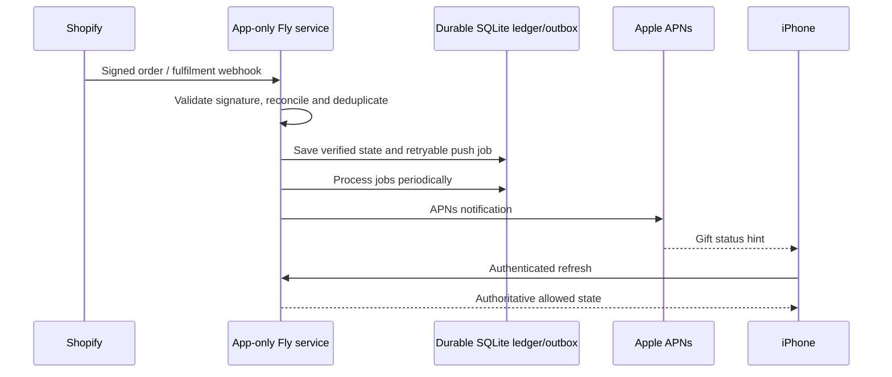
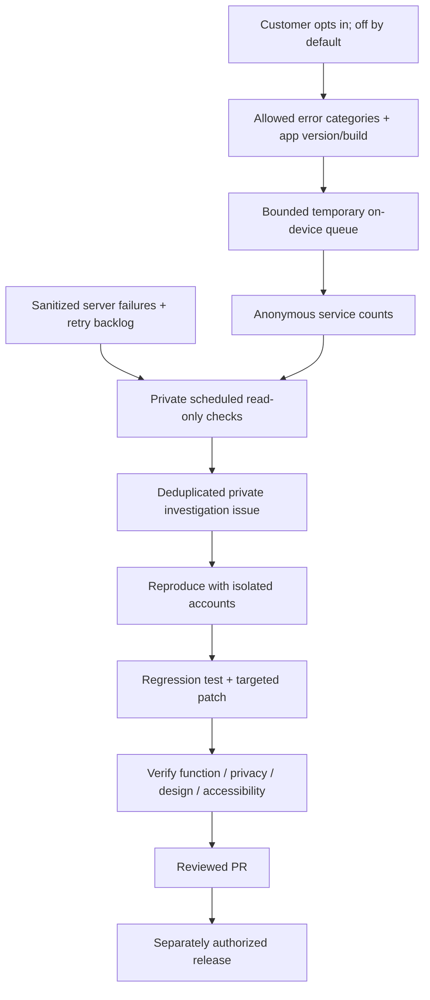

# How the app and shop fit together

Shopify stays the source of truth. The app is a native discovery, collection and gifting window; all physical-goods purchasing uses Shopify. The customer website has not been altered.

| Shared through Shopify | Separate app-only features |
|---|---|
| Product identity, exact option combinations, prices, stock, accounts and paid orders | Short editorial stories, discovery photo assignments and curated-set metadata consumed by the app |
| Shopify-owned checkout/payment and verified order events | Collection progress, outside-app purchase registration/review, wishlist sharing, received-gift records and badges |
| The original customer shop and its existing offers | App-only whole-set checkout verification; no stacking with individual charm offer; Terry exclusion retained |

App-only stories and image assignments are not website product-description/photo-order changes. Gold and coloured backgrounds guide charm discovery; a customer’s selected Silver/design variant uses its exact assigned photo. Earrings, chains and accessories retain their approved photography. Actual prices, stock and membership always win over reference fixtures.

## Events and notifications

There is no GooglePub/Sub, AmazonEventBridge, Redis or WebSocket service. Signed HTTPS webhooks and a durable SQLite outbox currently provide event handling; APNs delivers notifications. Push is a hint to refresh, never proof of purchase/ownership. Wrapped recipient responses omit item/buyer/note/price until successful unwrap and ledger sync. Carrier delivery and background/terminated-device pushes still need physical acceptance.

## Error reports and verified repairs

The live private monitor runs every30minutes. It probes health/catalogue/checkout readiness without creating orders and can file private investigation issues. Native telemetry is unreleased and optional. Reports contain fixed categories and app version/build, no names/customer/device IDs, orders, photos, messages, URLs or raw crash stacks. Locally queued reports expire after7days; server reports after30days. MetricKit may arrive late and is not exhaustive. Apple’s own diagnostics remain governed by Apple settings.

Automatic detection is connected; automatic coding/merging/deployment is not. A report starts an investigation, not an unverified production patch. No incident/customer payloads, operational tokens or private logs are in this public repository. A developer with private repo access should use its current README, AGENTS.md, operations runbook and regression matrix.
