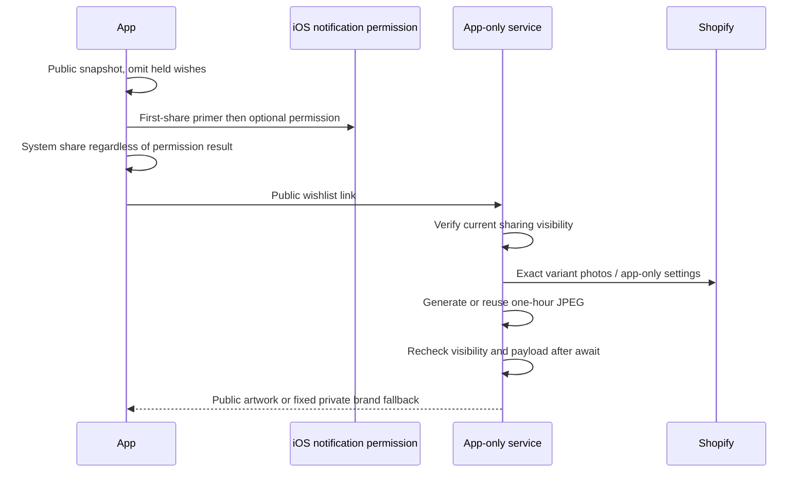

# Candidate46 · launch polish and neutral language

Authority: preserved handoff22, DEV-INSTRUCTIONS §5c/§5d and LAUNCH-POLISH. Pete explicitly selected all five launch-polish items. Build45 remains the device beta; build44 remains the unsubmitted Store draft. No candidate46 binary, Fly deployment or App Review submission is included.

| Item | Implementation | Verification boundary |
|---|---|---|
| L01 | Both public wishlist share entries use one presentation coordinator. Once/install, undetermined permission and configured push only: native PopSheet with three published wishes before system sharing. Enable or Skip continues sharing; denied permission never blocks it. Existing account-scoped Settings control remains. | Policy tests, normal/largest native sheet captures. Actual iPhone permission/APNs and share-to-Messages acceptance remain physical checks. |
| L02 | Server JPEG1200×630, pink ground, actual bundled Prata/Montserrat vector outlines, logo, first name/count in centre square, four exact-finish photos and gift action. OG/Twitter metadata uses the same count. Bounded one-hour renderer cache; every HTTP fetch revalidates privacy, including after async generation. Private/revoked/besties-only links receive fixed anonymous brand artwork. | Actual JPEG, HTTP tests including revoke-during-render, cache invalidation, missing images and malformed names. Messages/WhatsApp/Instagram crop/cache behavior needs actual devices; saved third-party previews cannot be recalled. |
| L03 | Header/chips appear immediately. An empty in-flight catalogue waits300ms before the skeleton, shimmer1.4s, Reduce Motion static, loading announcement once, retry at10s. Retrying restarts the Hot request and its deadline; catalogue retry queues once behind a still-running root refresh. Late Hot responses cannot overwrite a newer attempt. Existing catalogue remains visible during refresh. Loaded photos cross-fade200ms. | Production-content loading captures plus functional catalogue recovery; not a claim of a forced live outage. |
| L04 | Request Apple's rating UI after a verified badge's final celebration closes or verified gift reveal, with >=3 separated sessions and >=120days between requests. Block during error/checkout/basket; no prompting after failed unwrap or on mere gallery examples. | Unit tests of session threshold/cooldown, existing gift and badge evidence tests. Apple decides whether to show the prompt; TestFlight is not proof of display. |
| L05 | Info.plist UIUserInterfaceStyle Light and root preferred light scheme. | Optimized shipping-root checks with simulator appearance dark; actual external Shopify/Safari screens retain platform/site behavior. |

## Copy and Shopify boundary

Authored count copy is “12 pieces on the list”; singular is “1 piece on the list”. Outgoing native messages count only published wishes, never held private edits. The app-only private page says “Ask for a fresh link.” The retained future bestie label and prepared W03 source are neutral; the prepared Shopify proxy was not deployed.

Read-only Admin audit:137 products,113 app stories. Three Halloween character stories used gendered pronouns; these app-only story fields were amended, compareDigest-protected and read back. Every unrelated app setting and public description/media/variant/price remained unchanged. The native offline snapshot carries the amended stories; the older server fallback now includes matching approved app-only stories without changing its public catalogue records. No remaining gendered pronouns were found in those113 app stories. The live theme was pulled read-only; eight product templates repeat one customer testimonial with she/her. It remains unchanged under the explicit website-preservation instruction. Neither testimonials nor old designer reviews are represented as newly authored app copy.

## Architecture

The renderer uses pinned sharp and opentype.js. Glyph paths come directly from shipped fonts so Linux/macOS do not rely on installed system fonts. Photo fetching restricts HTTPS origins, rejects redirects, caps bytes/pixels and times out; missing photos never substitute another hardware finish. Docker installs the lockfile dependencies. Local generation and tests do not prove container deployment.

Evidence lives in ignored build/LaunchPolish46 and timestamped build/UserSimulation/Migration receipts. Failed compile/build-lock/test-assumption/test-selector runs are retained alongside corrected runs. Review46 records those boundaries and every omitted device-only screen. F50 Safari reopening and the existing accessibility acceptance track remain separate; no broad audit sign-off is implied.

## Verification summary

The isolated service matrix passed502 tests with no skips. Actual HTTP/DOM wishlist and private-link journeys passed; checkout interception preserved the live shop. Native privacy/gift/polish checks passed19 tests. Primary and smaller-device optimized basket/Settings checks passed; the primary device was set to dark appearance. Final optimized search, four repeated photo/Back returns and twelve slow/partial/fast paging gestures passed after selecting Shop explicitly in the test setup. Actual Reduce Motion and smaller-device largest-text sheet captures passed. The final policy and catalogue-retry recovery recheck passed5 tests without skips. Device-only APNs, permission/client previews and production container deployment remain explicit omissions, not functional failures hidden by the gallery.
