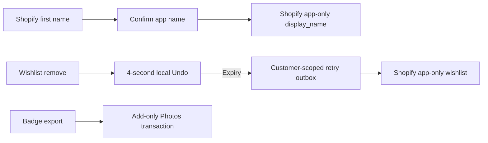

# Review53 · Everything since the Save video crash

[Gallery](index.html) · [Responses](RESPONSE.md) · [Manifest](manifest.json) · [Tests](TESTS.json) · [Release status](RELEASE.json)

This is one combined handover from released49 onwards. All screen captures are fresh53; reviews50,51 and52 remain unchanged. The app uses Prata/Montserrat, the existing pinks and the approved three-tab launch.

| Change | What and why | Review here |
|---|---|---|
| Save video | Photos invoked a UI-isolated callback on its own queue, causing the two reported crashes. A shared nonisolated transaction now saves video/cards safely, with add-only permission and clear failures. | B03, Still/Moving exports; real simulator PhotoKit tests |
| White logo | Replace typeset/pink share branding with the white asset and soft shadow. | B03, B04, OG |
| Your name | Prefill the Shopify first name, let the person confirm/edit16 graphemes, then proceed. Save only app.display_name, preserve account identity/privacy and website name. Settings uses the same editor. | O01, empty/limit/largest/keyboard; G06 NEXT |
| Swipe and Undo | Make wishlist removal discoverable; native full swipe, quiet blush Remove, four-second locally reversible deletion, safe offline/relaunch/account handling. | L01S/L01U, largest/small; G35U shared toast; five-second recording |

**Native platform difference:** iOS owns swipe action geometry and threshold. It translates the card rather than narrowing it; the native caption is system-controlled. This is declared partial, never hidden by retouching or competing gestures. Haptic sensation needs a phone.

**What to review:** O01 copy/layout and keyboard; B03/B04 white logo; L01 native swipe and undo at largest text. TestFlight notes in WHAT-TO-TEST.txt cover physical Photos saves and signed-in name persistence. Every capture is synthetic; no real customer details or crash payloads are published. Controlled393pt content does not prove real keyboard/OAuth; separate actual native-root captures show keyboard/tab layout. JPEG80/sRGB/max1179px; exact native exports remain unchanged.

**Still separate:** physical27.2 Save video, real OAuth/name cross-device persistence, Photos permission/VoiceOver/haptics/APNs/payment, F50 Safari, broader accessibility/performance acceptance. Feedback delivery stays disabled until Resend is configured. Nat still confirms the Founding Collector cutoff; current handoff default31January2027. This release does not resolve merchant silver-photo/free-chain-name/offer-copy approvals. No customer website changes or Store submission.

Use RELEASE.json for verified Apple processing/distribution and service rollout. A capture build number is not proof that Apple has distributed it. Gallery notes remain local until exported.
